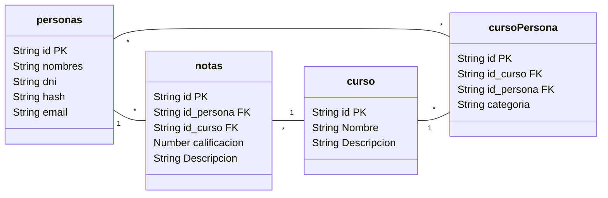

# Proyecto de Desarrolló de Software - BackEnd
Desarrollo de una API con Node.js, Fastify y MariaDB: Gestión de Notas para Alumnos y Profesores.

La API esta publicada en Postman: [link](https://documenter.getpostman.com/view/21376738/2s9YeD9DWL#)

## Formato - Base de Datos

## Librerias Utilizadas
* [Fastify](https://fastify.dev/)
* [DrizzleORM](https://orm.drizzle.team/)
* [TypeBox](https://github.com/sinclairzx81/typebox)
* [JsonWebToken](https://github.com/auth0/node-jsonwebtoken)
* [Bcrypt](https://github.com/kelektiv/node.bcrypt.js)

