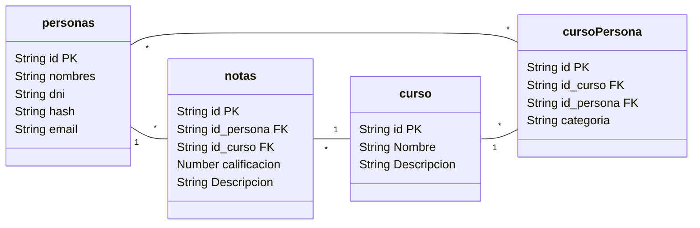

# Proyecto de Desarrolló de Software - BackEnd
Desarrollo de una API con Node.js, Fastify y MariaDB: Gestión de Notas para Alumnos y Profesores.

La API está publicada en Postman: [link](https://documenter.getpostman.com/view/21376738/2s9YeD9DWL#)

## Formato - Base de Datos

## Librerias Utilizadas
* [Fastify](https://fastify.dev/)
* [DrizzleORM](https://orm.drizzle.team/)
* [TypeBox](https://github.com/sinclairzx81/typebox)
* [JsonWebToken](https://github.com/auth0/node-jsonwebtoken)
* [Bcrypt](https://github.com/kelektiv/node.bcrypt.js)

## Instrucciones de Instalación del Proyecto

1. **Clonar el Repositorio:**
   ```bash
   git clone https://github.com/laucha54321/uni-be
   ```

2. **Ingresar al Directorio del Proyecto:**
   ```bash
   cd uni-be
   ```

3. **Instalar Dependencias:**
   ```bash
   npm install
   ```

4. **Configurar Variables de Entorno:**
   - Crea un archivo `.env` en el directorio raíz del proyecto y configura las variables de entorno necesarias. Puedes encontrar un ejemplo en el archivo `.env.example`.

5. **Iniciar la Aplicación:**
   ```bash
   npm run start
   ```
